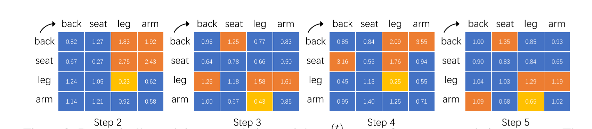
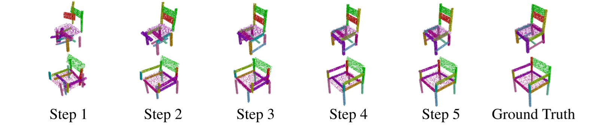

# Generative 3D Part Assembly via Dynamic Graph Learning


**Figure 1.** The proposed dynamic graph learning framework. The iterative graph neural network backbone takes a set of part point clouds as inputs and conducts 5 iterations of graph message-passing for coarse-to-fine part assembly refinements. The graph dynamics is encoded into two folds, (a) reasoning the part relation (graph structure) from the part pose estimation, which in turn also evolves from the updated part relations, and (b) alternatively updating the node set by aggregating all the geometrically-equivalent parts (the red and purple nodes), e.g. two chair arms, into a single node (the yellow node) to perform graph learning on a sparse node set for even time steps, and unpooling these nodes to the dense node set for odd time steps. Note the semi-transparent nodes and edges are not included in graph learning of certain time steps.


**Figure 2.** Dynamically evolving part relation weights among four common chair part types. The orange cells highlight the four directed edges with the maximal learned relation weight in the matrix, while the yellow cells indicate the minimal ones. The vertical axis denotes the emitting parts, and the horizontal axis denotes the receiving parts. We see clearly similar statistical patterns for the even iterations and for the odd ones. On average, the central parts have bigger emitting relation weights than the peripheral parts, indicating that the central parts guide the assembly process more.


**Figure 3.** Our model implicitly learns to refine the pose estimation of each input part point cloud in a coarse to fine manner. The poses for the central parts are firstly determined and then the peripheral parts gradually adjust their poses to match the central parts.  The central parts guide the assembly process more. 


## Introduction

Autonomous part assembly is a challenging yet crucial task in 3D computer vision and robotics. Analogous to buying an IKEA furniture, given a set of 3D parts that can assemble a single shape, an intelligent agent needs to perceive the 3D part geometry, reason to propose pose estimations for the input parts, and finally call robotic planning and control routines for actuation. In this paper, we focus on the pose estimation subproblem from the vision side involving geometric and relational reasoning over the input part geometry. Essentially, the task of generative 3D part assembly is to predict a 6-DoF part pose, including a rigid rotation and translation, for each input part that assembles a single 3D shape as the final output. To tackle this problem, we propose an assembly-oriented dynamic graph learning framework that leverages an iterative graph neural network as a backbone. It explicitly conducts sequential part assembly refinements in a coarse-to-fine manner, exploits a pair of part relation reasoning module and part aggregation module for dynamically adjusting both part features and their relations in the part graph. We conduct extensive experiments and quantitative comparisons to three strong baseline methods, demonstrating the effectiveness of the proposed approach.

## About the paper

Arxiv Version: https://arxiv.org/pdf/2006.07793.pdf


## Citations


    @InProceedings{HuangZhan2020PartAssembly,
        author = {Huang, Jialei and Zhan, Guanqi and Fan, Qingnan and Mo, Kaichun and Shao, Lin and Chen, Baoquan and Guibas, Leonidas and Dong, Hao},
        title = {Generative 3D Part Assembly via Dynamic Graph Learning},
        booktitle = {The IEEE Conference on Neural Information Processing Systems (NeurIPS)},
        year = {2020}
    }

## About this repository

This repository provides data and code as follows.


```
    data/                       # contains PartNet data
        partnet_dataset/		# you need this dataset only if you  want to remake the prepared data
    prepare_data/				# contains prepared data you need in our exps 
    							# and codes to generate data
    	Chair.test.npy			# test data list for Chair (please download the .npy files using the link below)
    	Chair.val.npy			# val data list for Chair
    	Chair.train.npy 		# train data list for Chair
    	...
    	prepare_shape.py/				# prepared data
    	prepare_contact_points.py/			# prepared data for contact points
    	
    exps/
    	utils/					# something useful
    	dynamic_graph_learning/	# our experiments code
    		logs/				# contains checkpoints and tensorboard file
    		models/				# contains model file in our experiments
    		scripts/			# scrpits to train or test
    		data_dynamic.py		# code to load data
    		test_dynamic.py  	# code to test
    		train_dynamic.py  	# code to train
    		utils.py
    environment.yaml			# environments file for conda
    		

```

This code has been tested on Ubuntu 16.04 with Cuda 10.0.130, GCC 7.5.0, Python 3.7.6 and PyTorch 1.1.0. 

Download the [pre-processed data](https://drive.google.com/drive/folders/1bmTaeIN2x7dqgQZCuTsiXaAGRZqEeSMP?usp=sharing) for the .npy data files in file prepare_data/


## Dependencies

Please run
    

        conda env create -f environment.yaml

to install the dependencies.

## Quick Start

Download [pretrained models](https://drive.google.com/drive/folders/1bmTaeIN2x7dqgQZCuTsiXaAGRZqEeSMP?usp=sharing) and unzip under the root directory.

## To train the model

Simply run

        cd exps/dynamic_graph_learning/scripts/
        ./train_dynamic.sh
        
## To test the model

modify the path of the model in the test_dynamic.sh file

run

        cd exps/dynamic_graph_learning/scripts/
        ./test_dynamic.sh

## Questions

Please post issues for questions and more helps on this Github repo page. We encourage using Github issues instead of sending us emails since your questions may benefit others.

## License

MIT License

## Updates

Please request in Github Issue for more code to release.

